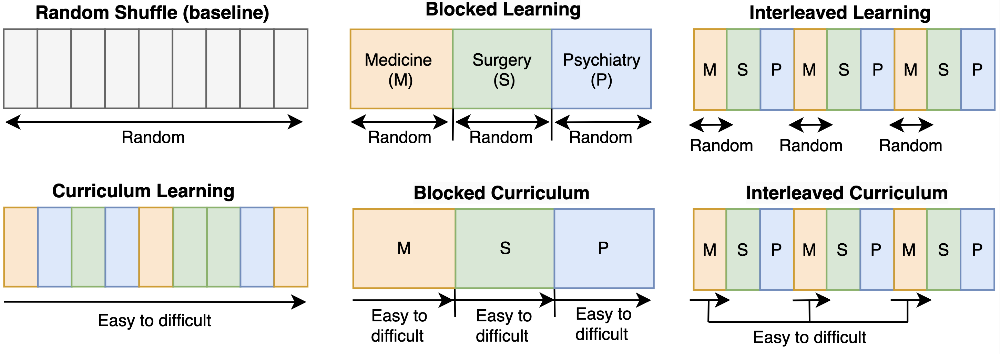

# Evaluating Fine-Tuning Efficiency of Human-Inspired Learning Strategies in Medical Question Answering

Code for the fine-tuning experiments in [Evaluating Fine-Tuning Efficiency of Human-Inspired Learning Strategies in Medical Question Answering](https://arxiv.org/abs/2408.07888), accepted at NeurIPS 2024 workshop [Fine-Tuning in Modern Machine Learning: Principles and Scalability (FITML)](https://sites.google.com/view/neurips2024-ftw).



## Overview

We explored how human-inspired learning strategies can be used to fine-tune large language models (LLMs) efficiently for multiple-choice medical question answering tasks. This code base provides scripts for measuring question difficulty with LLMs, generating human-inspired learning data orders, fine-tuning LLMs using [QLora](https://github.com/artidoro/qlora), and clustering for question categories.

## Installation

Make sure you have Python and `pip` installed. Install the required packages with:

```bash
pip install -r requirements.txt
```

## Measuring question difficulty with LLMs

1. To measure question difficulty using LLMs, run:
```bash
python ./measure_difficulty/baseline_script.py
```

2. To score questions based on LLM-defined difficulty, run:
```bash
python ./measure_difficulty/scoring.py
```

## Fine-tuning LLMs with QLora

1. To generate learning orders inspired by human-learning strategies, run:
```bash
python ./training/data_ordering.py
```

2. To fine-tune a LLM for multiple-choice datasets, run:
```bash
python ./training/fine-tuning/fine-tune.py
```

3. To run inference on multiple-choice datasets, run:
```bash
python ./training/inference/inference.py
```

## Clustering for question categories

To cluster question categories based on semantic similarity using UMAP and HDBSCAN, run:
```bash
python ./text_clustering.py
```

## Citation

If you find our work relevant, please cite it as follows:
```bibtex
@misc{yang2024finetuninglargelanguagemodels,
      title={Fine-tuning Large Language Models with Human-inspired Learning Strategies in Medical Question Answering}, 
      author={Yushi Yang and Andrew M. Bean and Robert McCraith and Adam Mahdi},
      year={2024},
      eprint={2408.07888},
      archivePrefix={arXiv},
      primaryClass={cs.CL},
      url={https://arxiv.org/abs/2408.07888}, 
}
```

